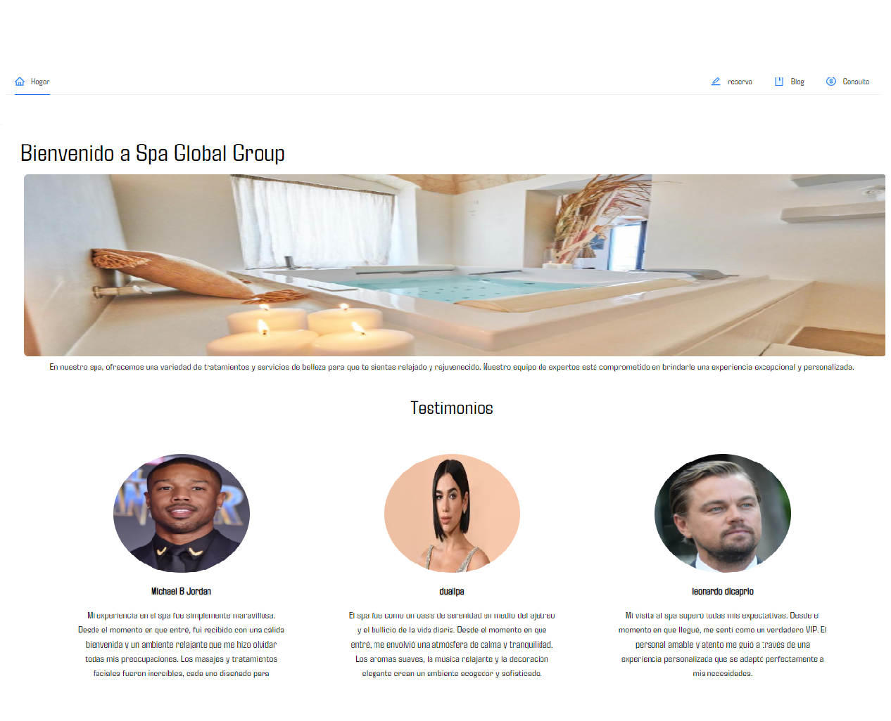

# SPA-FRONTEND2

Este es el repositorio del frontend de una aplicación de una SPA (Single Page Application) desarrollada con React.

## Descripción

Este proyecto es el frontend de una SPA que permite reservar sesiones en un spa. Proporciona un formulario donde los usuarios pueden seleccionar la hora, fecha y tipo de sesión que desean reservar. Al enviar el formulario

## Características

- Interfaz de usuario intuitiva y fácil de usar.
- Formulario interactivo para ingresar los detalles de la reserva.
- Integración con un backend para enviar los datos de reserva.

## Capturas de pantalla

## Instalación

1. Clona este repositorio en tu máquina local.
2. Navega hasta el directorio del proyecto: `cd vite-project`.
3. Instala las dependencias del proyecto: `npm install`.

## Uso

1. Inicia la aplicación: `npm run dev`.
2. Abre tu navegador web y visita `http://localhost:5173/`.

## Contribución

¡Las contribuciones son bienvenidas! Si deseas contribuir a este proyecto, sigue estos pasos:

1. Haz un fork del repositorio.
2. Crea una rama nueva para tu contribución.
3. Realiza los cambios necesarios y realiza los commits. Asegúrate de seguir las buenas prácticas de desarrollo.
4. Envía un pull request indicando claramente los cambios que has realizado.

## Autor

- [Angel Arraiz](https://github.com/arrayz-code) - Desarrollador principal.

## Licencia

Este proyecto está licenciado bajo la [Licencia MIT](LICENSE).
